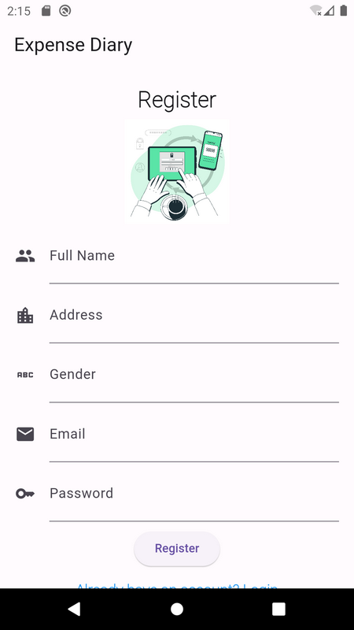
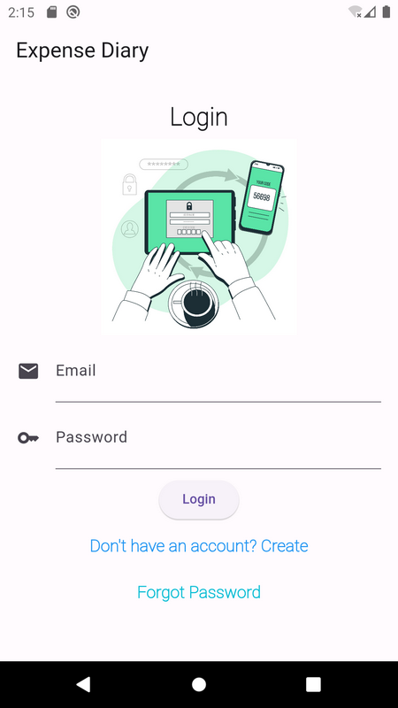
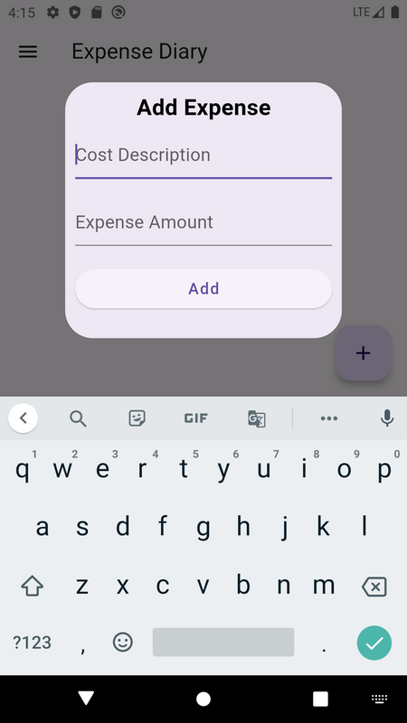
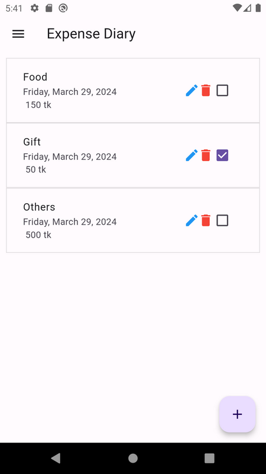
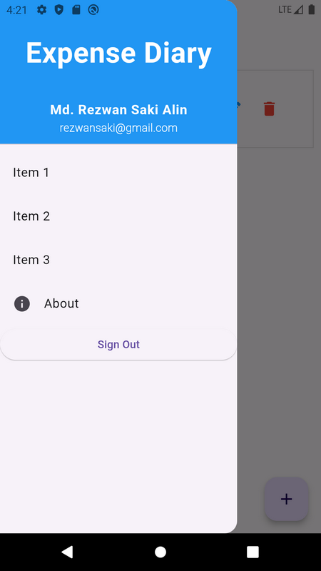

# Expense Diary - Flutter App

This is a practice project. A Flutter-Firebase project. 
Database and Authentication: Firebase.

## Image Credit:
1. https://www.freepik.com/  
<a href="https://www.freepik.com/free-vector/two-factor-authentication-concept-illustration_12892978.htm#page=2&query=login&position=2&from_view=search&track=sph&uuid=cdd01aa2-1087-49dd-91ef-e96b3756537b">Image by storyset</a> on Freepik

## Database and Firebase Config:
Firebase project name - 'expense-diary-flutter-app' on 'alinsworld2010@gmail.com'.
All config or options of Firebase - ‘lib\firebase_options.dart’. 

## Instruction:
<ul>  
    <li>1. flutter clean</li>
    <li>2. flutter pub get</li>
    <li>3. flutter run</li>
Note: Internet required.
</ul>

### Features:

<ul>
    <li>1. Features 1</li>
    <li>1. Features 2</li>
    <li>1. Features 3</li>
</ul>

### Extra Packages used:
 
<ul>
  <li>1. flutter_screenutil: ^5.9.0 - for responsie app design.</li>
  <li>2. shared_preferences: ^2.2.2 - for storing logn token in device.</li>  
  <li>3. firebase_core: ^2.24.2 - for firebase</li>  
  <li>4. firebase_auth: ^4.18.0 - for firebase authentication</li>  
  <li>5. cloud_firestore: ^4.15.10 - for firebase cloud firestore</li>  
  <li>6. intl: ^0.19.0 # for date and time</li>  
  <li>7. get: ^4.6.6 - GetX for State Management and other</li>  
</ul>

### Requires Android:

Minimum SDK Version: 21 (Android 5.0 or, Lollipop) and Target SDK Version: 34 (Android 14)

### Tested On:

- Emulator Pixel 2 API 29

### Used Tools:

Flutter 3.13.2 and Firebase.

### Apk Information:
Apk version: 1.0.0+1 (12-Dec-2023)  
This information has been taken from 'pubspec.yaml' file of flutter project.

#### Apk size:
00.00 MB (After build on APK for all platform)  
00.00 MB (After build on APK for specific platform)

### Start Date:

12-Dec-2023

### Last Update:

27-Mar-2024

### Developed by:

Md. Rezwan Saki Alin
https://www.alinsworld.com/

## License

Flutter is an open source framework by Google.

